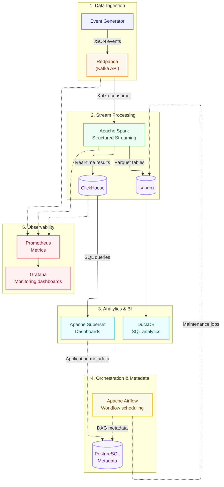

# User Behavior Analytics Platform (UBA)

A scalable, end-to-end real-time streaming data platform designed to capture, process, store, and visualize high-throughput user behavior events. 
This infrastructure combines real-time OLAP querying with a Data Lakehouse architecture, automated pipeline orchestration, and full-stack observability—all containerized using Docker.
---
## 📌 Table of Contents
- [Architecture Overview](#-architecture-overview)
- [Key Features](#-key-features)
- [Tech Stack](#-tech-stack)
- [Architecture Decision Records (ADR)](#-architecture-decision-records-adr)
- [Timezone Synchronization](#-timezone-synchronization)
- [Service Endpoints](#-service-endpoints)
- [Getting Started](#-getting-started)
- [Verification & Demo Scenario](#-verification--demo-scenario)
---
## 🏛 Architecture Overview
The system processes incoming clickstream JSON events from an event generator through a 5-layer pipeline architecture:

## ✨ Key Features
 * **Real-Time Stream Processing:** Ingests and enriches micro-batch user events (e.g., view_item, add_to_cart, checkout) with sub-second latency.
 * **Dual-Storage Engine:**
   * **ClickHouse:** Real-time OLAP data warehouse for instant dashboard queries and aggregate aggregations.
   * **Apache Iceberg:** Open table format Data Lakehouse for historic retention, time-travel queries, and ACID compliance.
 * **Automated Lakehouse Maintenance:** Scheduled Airflow DAGs for compaction of small Parquet files and snapshot cleanup.
 * **Fast Ad-Hoc Analytics:** Direct SQL queries over Iceberg tables via **DuckDB**.
 * **Full Infrastructure Observability:** Real-time system metrics scraped by Prometheus and visualized in Grafana dashboards.
## 🛠 Tech Stack
| Domain | Technology / Tool |
|---|---|
| **Ingestion** | Redpanda (Kafka-compatible streaming platform
> .:
), Custom Python Generator |
| **Processing** | Apache Spark (Structured Streaming) |
| **Storage & Lakehouse** | ClickHouse OLAP, Apache Iceberg (Parquet Format) |
| **Metadata Store** | PostgreSQL 15 |
| **Analytics & BI** | Apache Superset, DuckDB |
| **Orchestration** | Apache Airflow 2.x |
| **Observability** | Prometheus, Grafana |
| **Containerization** | Docker, Docker Compose |
## 🧠 Architecture Decision Records (ADR)
### 1. Why Redpanda over Apache Kafka?
Redpanda is a C++ implementation of the Kafka protocol. It eliminates JVM overhead and Zookeeper/KRaft dependencies, resulting in significantly lower memory consumption and faster startup times in local containerized environments.
### 2. Why ClickHouse + Apache Iceberg Dual Storage?
ClickHouse provides sub-second aggregations required by business users on live dashboards. Apache Iceberg provides long-term persistence, schema evolution, and ACID transactions over cheap Object/Parquet storage without locking data into a single vendor.
### 3. Why DuckDB for Ad-Hoc Queries?
DuckDB allows zero-overhead, high-performance vectorized SQL queries directly over Iceberg Parquet files on disk without needing a running server cluster.
## ⏰ Timezone Synchronization
To avoid **clock drift** and Prometheus Out of bounds / timestamp error issues, all services in the cluster are synchronized to a unified timezone (Asia/Tehran / UTC+03:30). Timezone settings are mapped directly via host /etc/localtime and system environment variables (TZ=Asia/Tehran).
## 🌐 Service Endpoints
Once the environment is running, access the web UIs using the following links:
| Service | Port / URL | Default Credentials | Description |
|---|---|---|---|
| **Redpanda Console** | http://localhost:8080 | N/A | Kafka Topics & Messages Viewer |
| **Spark Master UI** | http://localhost:8085 | N/A | Streaming Job & Executor Stats |
| **Apache Airflow** | http://localhost:8082 | admin / admin | Pipeline Orchestration Panel |
| **Apache Superset** | http://localhost:8088 | admin / admin | User Behavior Dashboards |
| **Grafana** | http://localhost:3000 | admin / admin | Infrastructure Metrics Panel |
| **Prometheus** | http://localhost:9090 | N/A | Target Metrics Collector |
| **ClickHouse HTTP** | http://localhost:8123 | clickhouse_admin | Database Interface |
## 🚀 Getting Started
### Prerequisites
 * Docker Engine >= 24.0
 * Docker Compose >= 2.20
 * At least 8 GB allocated RAM for Docker
## Environment Configuration

Before starting the platform, create your local environment file:

```bash
cp .env.example .env
```

Review and update the environment variables according to your local environment.

> **Note:** The `.env` file contains local configuration values and credentials. It is excluded from version control through `.gitignore` and should **never** be committed to the repository.

---

# Installation & Deployment

## 1. Clone the repository

```bash
git clone https://github.com/amir-m-hmd/uba-platform.git
cd uba-platform
```

## 2. Start all infrastructure services

```bash
docker compose up -d
```

## 3. Initialize the Superset database and create the admin user

```bash
docker exec -it uba_superset superset db upgrade
docker exec -it uba_superset superset init
```

   
   ## 🧪 Verification & Demo Scenario
To verify the live data flow across the pipeline:
 1. **Generate Real-Time Events:**
   Ensure the event-generator service is active to push events to Redpanda:
   bash
   docker compose logs -f event-generator
   
    2. **Verify Stream Processing in ClickHouse:**
   Connect to ClickHouse and observe live growing event counts:
   sql
   SELECT event_type, count(*) 
   FROM uba_analytics.user_events_enriched 
   GROUP BY event_type;
   
   ```
 3. Run Airflow Compaction DAG:
   Navigate to Airflow UI (http://localhost:8082), trigger uba_lakehouse_daily_analytics_and_maintenance DAG to execute Iceberg maintenance tasks.
 4. View Dashboards:
   Open Apache Superset (http://localhost:8088) and view the User Behavior Analytics dashboard for funnel charts and time-series distributions.
```


## 📬 Contact & Support
If you have any questions, feedback, or would like to discuss this project further, feel free to reach out:
[](https://t.me/Amir_hmd_h)
Telegram ID: [@Amir_hmd_h](https://t.me/Amir_hmd_h)
